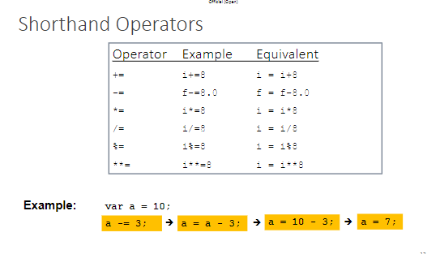
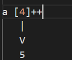
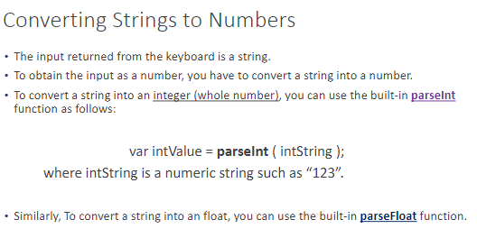

# Topic 2

## [Document to refer](../School%20Notes/Topic%202%20Operators%20&%20Selections(I)v1.pdf)

Table of contents listed below:
- [Topic 2](#topic-2)
  - [Document to refer](#document-to-refer)
- [Constrants](#constrants)
- [Operators](#operators)
  - [Use of remainder operator (%)](#use-of-remainder-operator-)
- [Shorthand Operators](#shorthand-operators)
  - [Boolean Operators](#boolean-operators)
- [If Statement](#if-statement)
  - [Operator Precedence and Evaluation Order](#operator-precedence-and-evaluation-order)
- [This is IMPORTANT](#this-is-important)
  - [String Data Type](#string-data-type)
- [Data Type](#data-type)
  - [Obtaining User Input](#obtaining-user-input)
- [Node Package Manager (NPM)](#node-package-manager-npm)
- [Converting Strings to Numbers](#converting-strings-to-numbers)
  - [Can also use this](#can-also-use-this)
  - [Selection Statements](#selection-statements)


# Constrants
<h4>

>Represents permanent values
    >> eg pi = 3.14159

- 3 Benefits:
    - 1. Improves readability
    - 2. Improves maintainability
    - 3. Improves reliability

- Syntax:
    - const data_type constant_name = value;

- Example:
    - const int PI = 3.14159;


# Operators


Operators are used to perform operations on variables and values.


- Numeric Operators
    - +, -, *, /, %, ++, --

- Relational Operators
    - ==, !=, >, <, >=, <=

- Logical Operators
    - &&, ||, !

- Bitwise Operators
    - &, |, ^, ~, <<, >>

- Assignment Operators
    - =, +=, -=, *=, /=, %=, <<=, >>=, &=, ^=, |=


## Use of remainder operator (%)


> To determine whether a number is even or odd, use the remainder operator (%). If the remainder is 0, the number is even; otherwise, it is odd.

- an even number %2 is always 0
- an odd number %2 is always 1

> To determine whether a number is divisible by another number, use the remainder operator (%). If the remainder is 0, the number is divisible by the other number; otherwise, it is not divisible.

- e.g Result of 67 % 5 is 2, but 65% 5 is 0

So if a numver % 5 is 0 ---> it is divisible by 5


# Shorthand Operators


 +=, -=, *=, /=, %=, <<=, >>=, &=, ^=, |=

-------------------------
Example:

``` javascript
var x = 5;
x += 5; // x = x + 5
console.log(x); //10
```


Increment and Decrement Operators

- ++, --

``` javascript
var x = 5;
x++; // x = x + 1
console.log(x); //6
```


Example 

``` javascript
x = 5;
y = 4;
z = 3;

z = x // 5
x ++= y // 9
y = z // 5
```


What is this output
    
``` javascript
a = 2; // a = 2
a= a++ + a; // a = 2 + 3
console.log(a); // 5

//explaination: why is a 3 and not 2?
// a++ is 2, but a is 3
    
```


``` javascript
b =2;
b = b + b++; // b = 2 + 2
console.log(b); // 4
//explaination: b++ is 2, but b is 4
``` 

## Boolean Operators


| Operator | Description |
|----------|-------------|
| !        | Not         |
| &&       | And         |
| \|\|     | Or          |

Example:
    
``` javascript
var b1 = true, b2 = false, b3 = true;
console.log(b1 && b2); // false
console.log(b1 || b2); // true
console.log(!b1); // false
console.log(b1 && b2 && b3); // false
console.log(b1 || b2 || b3); // true
console.log(b1 && b2 || b3); // true
```
Explanation:
When using &&, if one of the value is false, the whole thing is false
When using ||, if one of the value is true, the whole thing is true


``` javascript
var b1 = true, b2 = false, b3 = true;
var a1 = 1, a2 = 2, a3 = 3;
console.log (b1 && b2 || b3);

/*
Alright, let's think of this as a wacky game show where b1, b2, and b3 are three contestants who are either really excited (true) or not excited (false) to be there.

The game show host asks the contestants two questions:

"Are both b1 and b2 excited?" - This is what b1 && b2 means.
"Is b3 excited?" - This is what b3 means.
Now, if either of these questions gets a "Yes" (true), the audience will cheer. That's what || (or operator) is about: if either side is true, then the whole expression is true.

So, let's see what happens:

b1 (true) and b2 (false) - b1 is excited, but b2 is not. So the answer to the first question is "No" (false).
b3 (true) - b3 is excited! So the answer to the second question is "Yes" (true).
Since we got a "Yes" to one of the questions, the audience cheers - which means the console.log will output true.
*/
```


| Operator | Description |
|----------|-------------|
| &&       | Logical AND |
| \|\|     | Logical OR  |
| !        | Logical NOT |


-------------------------


# If Statement


``` javascript
if (condition) {
    // code to be executed if condition is true
}
```

``` javascript
var num = 8;

console.log("Is " + num + " divisible by 2 and 3? " +((num % 2 == 0) && (num % 3 == 0)));

console.log("Is " + num + " divisible by 2 or 3? " +((num % 2 == 0) || (num % 3 == 0)));

// Is 8 divisible by 2 and 3? false
// Is 8 divisible by 2 or 3? true
// explaination: 8 is divisible by 2, but not 3
```

## Operator Precedence and Evaluation Order


- The expression is evaluated from left to right

When 2 operators have the same precedence, operands are then evaluated from left to right, except for ** and ++ which are evaluated from right to left.

Star is to the power of (*) and double star is to the power of 2 (**)

``` javascript
var x = 2;
var y = 3;
var z = 4;

console.log(x + y * z); // 14
console.log((x + y) * z); // 20
console.log(x ** y ** z); // 2417851639229258349412352
console.log(x ** (y ** z)); // 2417851639229258349412352
console.log((x ** y) ** z); // 4096
```


# This is IMPORTANT


## String Data Type


- A string is a sequence of characters surrounded by single or double quotes.

``` javascript
var str = "Hello World!";
console.log(str);
```
Any value can be converted to a string using the String() function.

# Data Type 


Sure, here's an example markdown table of common data types:

| Data Type | Description |
|-----------|-------------|
| Number    | Numeric values, including integers and floating-point numbers |
| String    | Textual data, enclosed in quotes |
| Boolean   | Logical values of true or false |
| Null      | Represents a deliberate non-value |
| Undefined | Represents a value that is not yet defined |
| Object    | A collection of related data and/or functionality |
| Array     | A collection of values, typically of the same data type |


## Obtaining User Input


- Why do we need user input?
    - To make our programs interactive

- How do we obtain user input?
    - Using the prompt() function

- Syntax:
    - prompt("message");

- Example:  

``` javascript  
var name = prompt("What is your name?");    
console.log("Hello " + name + "!");  
```

# Node Package Manager (NPM)

- NPM is a package manager for JavaScript
    - Developers from all over the world contribute to the NPM registry
<br> <br>
- NPM is installed with Node.js

    Download the libary using this code

        npm install readline-sync

    Then, import the library using this code


# Converting Strings to Numbers


- To input a returned from the keyboard as a number, use the Number() function.

- To obtain the input from the keyboard, use the prompt() function.

- To convert the input to a number, use the Number() function.

``` javascript

var num1 = Number(prompt("Enter a number: "));
var num2 = Number(prompt("Enter another number: "));
var sum = num1 + num2;
console.log("The sum of " + num1 + " and " + num2 + " is " + sum);

```

``` javascript
var a = input.question("What is your number for A? ");
var b = input.question("What is your number for B? ");
var c = parseInt (a) + parseInt (b);

console.log("c " + c);
```
``` javascript
var.toFixed(1) // 1 decimal place
```
- What is parseInt?
    - parseInt is a function that converts a string to an integer


A quicker way to do it 

``` javascript
var a = input.questionInt("What is your number for A? ");
var b = input.questionInt("What is your number for B? ");
// var c = parseInt (a) + parseInt (b);
var c = a + b;

console.log("c " + c);
```
Using input.questionInt will automatically convert the string to an integer 

## Can also use this 


## Selection Statements


- Selection statements allow us to execute code based on a condition
    - If statements
    - Switch statements
Example 

``` javascript 
If (condition) {
    // code to be executed if condition is true
}
```

``` javascript
var num = 8;
if (num % 2 == 0) {
    console.log(num + " is even");
}
// Output: 8 is even
```

